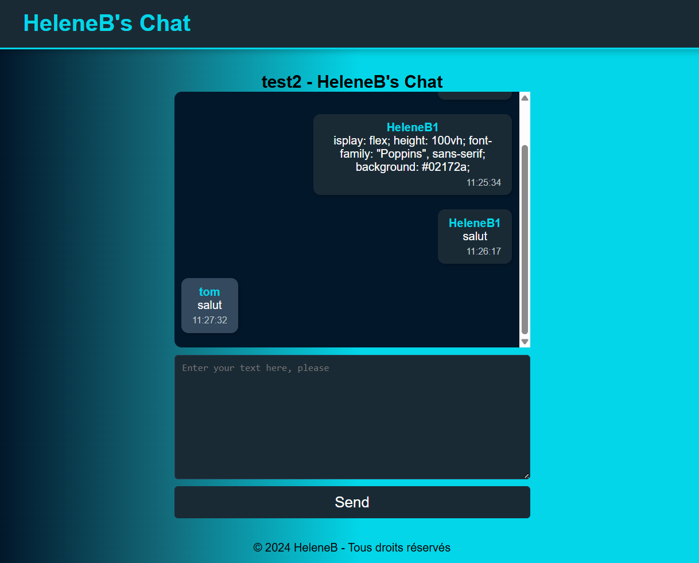

# DJANGOCHAT

## Description

DjangoChat est une application de chat en temps réel construite avec Django et Channels. Elle utilise Daphne pour gérer les connexions WebSocket et ASGI pour le support asynchrone.

## Prérequis

Avant de commencer, assure-toi que tu as Python installé sur ton système. Il est recommandé d'utiliser un environnement virtuel pour isoler les dépendances de ton projet.

## Installation des dépendances

Clone ce dépôt ou télécharge-le.
Crée un environnement virtuel si tu ne l'as pas déjà fait :

```bash
python -m venv env

- Active ton environnement virtuel :

Sur Windows :
.\env\Scripts\activate

Sur macOS/Linux :
source env/bin/activate
```

Installe les dépendances requises :

```bash
pip install --upgrade -r requirements.txt
```

Liste des dépendances
Le fichier requirements.txt contient toutes les bibliothèques nécessaires pour faire fonctionner ce projet. Voici les principales :

<details>

```bash
asgiref==3.8.1
attrs==24.2.0
autobahn==24.4.2
Automat==24.8.1
cffi==1.17.1
channels==4.2.0
constantly==23.10.4
cryptography==44.0.0
daphne==4.1.2
Django==5.1.3
hyperlink==21.0.0
idna==3.10
incremental==24.7.2
pyasn1==0.6.1
pyasn1_modules==0.4.1
pycparser==2.22
pyOpenSSL==24.3.0
service-identity==24.2.0
setuptools==75.6.0
sqlparse==0.5.2
Twisted==24.11.0
txaio==23.1.1
typing_extensions==4.12.2
tzdata==2024.2
zope.interface==7.2
```

</details>
Lancer le projet
Pour démarrer l'application, tu dois utiliser Daphne, qui est un serveur ASGI (Asynchronous Server Gateway Interface).

Assure-toi que toutes les dépendances sont installées.
Lance le serveur Daphne avec la commande suivante :

```bash
daphne -p 8000 djangochat.asgi:application
```

Cela démarre le serveur sur le port 8000.

## Remarques importantes

Assure-toi d'avoir configuré correctement les composants de ton projet, y compris les paramètres d'ASGI et de Channels, avant de démarrer le serveur.
Si tu rencontres des problèmes lors de l'installation, vérifie que toutes les dépendances sont compatibles avec ta version de Python et que ton environnement virtuel est activé.
Pour plus de détails, tu peux consulter la documentation de Django Channels et Daphne.
